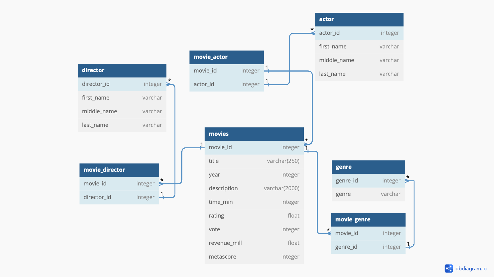

# Movies Api

Date - 06/29/24

Author - Shivam Patel

---

### Descripition

Using the knowledge from the last couple months on ER-diagrams and API's from my mentor. I am proud to create my first git repo. This repository includes an API that I created to handle numerous amounts of movie data and to fetch information from the database. This API contains all CRUD (create, read, update, delete) routes and was established using Python Flask. The data is fetched from the backend using Python and then shown in the frontend using JavaScript and HTML5.

## Tech Stack:
- **Database**: PostgresSQL
- **Validation/Parsing**: Pydantic
- **Web Framework**: Flask
- **CSS Library**: Bootstrap 5
- **Languages**: Python, HTML5, JavaScript

### Psycopg2 for M2

`M2 Mac` needs `psycopg2-binary` instead of the regular `psycopg2`.

### ER Diagram
----

An overview on how the database was setup for the movies

API Endpoints
----

### Movies

<table>
    <thead>
        <tr>
            <th style="border: 0.5px solid grey; padding: 8px;">Endpoint</th>
            <th style="border: 0.5px solid grey; padding: 8px;">HTTP Method</th>
            <th style="border: 0.5px solid grey; padding: 8px;">Result</th>
        </tr>
    <thead>
    <tbody>
        <tr>
            <td style="border: 0.5px solid grey; padding: 8px;"><code>/movies/all<code></td>
            <td style="border: 0.5px solid grey; padding: 8px;"><code>GET<code></td>
            <td style="border: 0.5px solid grey; padding: 8px;">Returns all movies</td>
        </tr>
        <tr>
            <td style="border: 0.5px solid grey; padding: 8px;"><code>/movies/{movie_id}<code></td>
            <td style="border: 0.5px solid grey; padding: 8px;"><code>GET<code></td>
            <td style="border: 0.5px solid grey; padding: 8px;">Returns a movie by ID</td>
        </tr>
            <tr>
            <td style="border: 0.5px solid grey; padding: 8px;"><code>/movies/directors/{movie_id}<code></td>
            <td style="border: 0.5px solid grey; padding: 8px;"><code>GET<code></td>
            <td style="border: 0.5px solid grey; padding: 8px;">Returns a movie by ID and the directors of the movie</td>
        </tr>
            <tr>
            <td style="border: 0.5px solid grey; padding: 8px;"><code>/movies/actors/{movie_id}<code></td>
            <td style="border: 0.5px solid grey; padding: 8px;"><code>GET<code></td>
            <td style="border: 0.5px solid grey; padding: 8px;">Returns a movie by ID and the actors of the movie</td>
        </tr>
            <tr>
            <td style="border: 0.5px solid grey; padding: 8px;"><code>/movies/genres/{movie_id}<code></td>
            <td style="border: 0.5px solid grey; padding: 8px;"><code>GET<code></td>
            <td style="border: 0.5px solid grey; padding: 8px;">Returns a movie by ID and the genres of the movie</td>
        </tr>
            <tr>
            <td style="border: 0.5px solid grey; padding: 8px;"><code>/movies/filter/exact<code></td>
            <td style="border: 0.5px solid grey; padding: 8px;"><code>POST<code></td>
            <td style="border: 0.5px solid grey; padding: 8px;">Returns movie by exact title (lower or upper)</td>
        </tr>
            <tr>
            <td style="border: 0.5px solid grey; padding: 8px;"><code>/movies/filter/exact<code></td>
            <td style="border: 0.5px solid grey; padding: 8px;"><code>POST<code></td>
            <td style="border: 0.5px solid grey; padding: 8px;">Returns all movies with similar characters in the movie title</td>
        </tr>
               </tr>
            <tr>
            <td style="border: 0.5px solid grey; padding: 8px;"><code>/movies/filter/in<code></td>
            <td style="border: 0.5px solid grey; padding: 8px;"><code>POST<code></td>
            <td style="border: 0.5px solid grey; padding: 8px;">Returns all movies passed through json list</td>
        </tr>
               </tr>
            <tr>
            <td style="border: 0.5px solid grey; padding: 8px;"><code>/movies/create<code></td>
            <td style="border: 0.5px solid grey; padding: 8px;"><code>POST<code></td>
            <td style="border: 0.5px solid grey; padding: 8px;">Creates a new movie in the database</td>
        </tr>
               </tr>
            <tr>
            <td style="border: 0.5px solid grey; padding: 8px;"><code>/movies/{movie_id}<code></td>
            <td style="border: 0.5px solid grey; padding: 8px;"><code>PUT<code></td>
            <td style="border: 0.5px solid grey; padding: 8px;">Updates movie by ID in the database</td>
        </tr>
               </tr>
            <tr>
            <td style="border: 0.5px solid grey; padding: 8px;"><code>/movies/{movie_id}<code></td>
            <td style="border: 0.5px solid grey; padding: 8px;"><code>DELETE<code></td>
            <td style="border: 0.5px solid grey; padding: 8px;">Deletes movie by ID in the database</td>
        </tr>
    <tbody>
</table>

### Directors

<table>
    <thead>
        <tr>
            <th style="border: 0.5px solid grey; padding: 8px;">Endpoint</th>
            <th style="border: 0.5px solid grey; padding: 8px;">HTTP Method</th>
            <th style="border: 0.5px solid grey; padding: 8px;">Result</th>
        </tr>
    <thead>
    <tbody>
        <tr>
            <td style="border: 0.5px solid grey; padding: 8px;"><code>/directors/all<code></td>
            <td style="border: 0.5px solid grey; padding: 8px;"><code>GET<code></td>
            <td style="border: 0.5px solid grey; padding: 8px;">Returns all directors</td>
        </tr>
        <tr>
            <td style="border: 0.5px solid grey; padding: 8px;"><code>/directors/{movie_id}<code></td>
            <td style="border: 0.5px solid grey; padding: 8px;"><code>GET<code></td>
            <td style="border: 0.5px solid grey; padding: 8px;">Returns a director by ID</td>
        </tr>
        <tr>
            <td style="border: 0.5px solid grey; padding: 8px;"><code>/directors/movies/{director_id}<code></td>
            <td style="border: 0.5px solid grey; padding: 8px;"><code>GET<code></td>
            <td style="border: 0.5px solid grey; padding: 8px;">Returns a director by ID and the data of the movie</td>
        </tr>
        <tr>
            <td style="border: 0.5px solid grey; padding: 8px;"><code>/directors/create<code></td>
            <td style="border: 0.5px solid grey; padding: 8px;"><code>POST<code></td>
            <td style="border: 0.5px solid grey; padding: 8px;">Creates a new director in the database</td>
        </tr>
        <tr>
            <td style="border: 0.5px solid grey; padding: 8px;"><code>/directors/{director_id}<code></td>
            <td style="border: 0.5px solid grey; padding: 8px;"><code>PUT<code></td>
            <td style="border: 0.5px solid grey; padding: 8px;">Updates director by ID in the database</td>
        </tr>
        <tr>
            <td style="border: 0.5px solid grey; padding: 8px;"><code>/directors/{director_id}<code></td>
            <td style="border: 0.5px solid grey; padding: 8px;"><code>DELETE<code></td>
            <td style="border: 0.5px solid grey; padding: 8px;">Deletes director by ID in the database</td>
        </tr>
    <tbody>
</table>

### Actors

<table>
    <thead>
        <tr>
            <th style="border: 0.5px solid grey; padding: 8px;">Endpoint</th>
            <th style="border: 0.5px solid grey; padding: 8px;">HTTP Method</th>
            <th style="border: 0.5px solid grey; padding: 8px;">Result</th>
        </tr>
    <thead>
    <tbody>
        <tr>
            <td style="border: 0.5px solid grey; padding: 8px;"><code>/actor/all<code></td>
            <td style="border: 0.5px solid grey; padding: 8px;"><code>GET<code></td>
            <td style="border: 0.5px solid grey; padding: 8px;">Returns all actors</td>
        </tr>
        <tr>
            <td style="border: 0.5px solid grey; padding: 8px;"><code>/actor/{actor_id}<code></td>
            <td style="border: 0.5px solid grey; padding: 8px;"><code>GET<code></td>
            <td style="border: 0.5px solid grey; padding: 8px;">Returns a actor by ID</td>
        </tr>
        <tr>
            <td style="border: 0.5px solid grey; padding: 8px;"><code>/actor/movies/{actor_id}<code></td>
            <td style="border: 0.5px solid grey; padding: 8px;"><code>GET<code></td>
            <td style="border: 0.5px solid grey; padding: 8px;">Returns a actor by ID and the data of the movie</td>
        </tr>
        <tr>
            <td style="border: 0.5px solid grey; padding: 8px;"><code>/actor/create<code></td>
            <td style="border: 0.5px solid grey; padding: 8px;"><code>POST<code></td>
            <td style="border: 0.5px solid grey; padding: 8px;">Creates a new actor in the database</td>
        </tr>
        <tr>
            <td style="border: 0.5px solid grey; padding: 8px;"><code>/actor/{director_id}<code></td>
            <td style="border: 0.5px solid grey; padding: 8px;"><code>PUT<code></td>
            <td style="border: 0.5px solid grey; padding: 8px;">Updates actor by ID in the database</td>
        </tr>
        <tr>
            <td style="border: 0.5px solid grey; padding: 8px;"><code>/actor/{director_id}<code></td>
            <td style="border: 0.5px solid grey; padding: 8px;"><code>DELETE<code></td>
            <td style="border: 0.5px solid grey; padding: 8px;">Deletes actor by ID in the database</td>
        </tr>
    <tbody>
</table>

### Actors

<table>
    <thead>
        <tr>
            <th style="border: 0.5px solid grey; padding: 8px;">Endpoint</th>
            <th style="border: 0.5px solid grey; padding: 8px;">HTTP Method</th>
            <th style="border: 0.5px solid grey; padding: 8px;">Result</th>
        </tr>
    <thead>
    <tbody>
        <tr>
            <td style="border: 0.5px solid grey; padding: 8px;"><code>/actor/all<code></td>
            <td style="border: 0.5px solid grey; padding: 8px;"><code>GET<code></td>
            <td style="border: 0.5px solid grey; padding: 8px;">Returns all actors</td>
        </tr>
        <tr>
            <td style="border: 0.5px solid grey; padding: 8px;"><code>/actor/{actor_id}<code></td>
            <td style="border: 0.5px solid grey; padding: 8px;"><code>GET<code></td>
            <td style="border: 0.5px solid grey; padding: 8px;">Returns a actor by ID</td>
        </tr>
        <tr>
            <td style="border: 0.5px solid grey; padding: 8px;"><code>/actor/movies/{actor_id}<code></td>
            <td style="border: 0.5px solid grey; padding: 8px;"><code>GET<code></td>
            <td style="border: 0.5px solid grey; padding: 8px;">Returns a actor by ID and the data of the movie</td>
        </tr>
        <tr>
            <td style="border: 0.5px solid grey; padding: 8px;"><code>/actor/create<code></td>
            <td style="border: 0.5px solid grey; padding: 8px;"><code>POST<code></td>
            <td style="border: 0.5px solid grey; padding: 8px;">Creates a new actor in the database</td>
        </tr>
        <tr>
            <td style="border: 0.5px solid grey; padding: 8px;"><code>/actor/{actor_id}<code></td>
            <td style="border: 0.5px solid grey; padding: 8px;"><code>PUT<code></td>
            <td style="border: 0.5px solid grey; padding: 8px;">Updates actor by ID in the database</td>
        </tr>
        <tr>
            <td style="border: 0.5px solid grey; padding: 8px;"><code>/actor/{actor_id}<code></td>
            <td style="border: 0.5px solid grey; padding: 8px;"><code>DELETE<code></td>
            <td style="border: 0.5px solid grey; padding: 8px;">Deletes actor by ID in the database</td>
        </tr>
    <tbody>
</table>

### Genres

<table>
    <thead>
        <tr>
            <th style="border: 0.5px solid grey; padding: 8px;">Endpoint</th>
            <th style="border: 0.5px solid grey; padding: 8px;">HTTP Method</th>
            <th style="border: 0.5px solid grey; padding: 8px;">Result</th>
        </tr>
    <thead>
    <tbody>
        <tr>
            <td style="border: 0.5px solid grey; padding: 8px;"><code>/genre/all<code></td>
            <td style="border: 0.5px solid grey; padding: 8px;"><code>GET<code></td>
            <td style="border: 0.5px solid grey; padding: 8px;">Returns all genres</td>
        </tr>
        <tr>
            <td style="border: 0.5px solid grey; padding: 8px;"><code>/genre/{genre_id}<code></td>
            <td style="border: 0.5px solid grey; padding: 8px;"><code>GET<code></td>
            <td style="border: 0.5px solid grey; padding: 8px;">Returns a genres by ID</td>
        </tr>
        <tr>
            <td style="border: 0.5px solid grey; padding: 8px;"><code>/genre/create<code></td>
            <td style="border: 0.5px solid grey; padding: 8px;"><code>POST<code></td>
            <td style="border: 0.5px solid grey; padding: 8px;">Creates a new genre in the database</td>
        </tr>
        <tr>
            <td style="border: 0.5px solid grey; padding: 8px;"><code>/genre/{genre_id}<code></td>
            <td style="border: 0.5px solid grey; padding: 8px;"><code>PUT<code></td>
            <td style="border: 0.5px solid grey; padding: 8px;">Updates genre by ID in the database</td>
        </tr>
        <tr>
            <td style="border: 0.5px solid grey; padding: 8px;"><code>/genre/{genre_id}<code></td>
            <td style="border: 0.5px solid grey; padding: 8px;"><code>DELETE<code></td>
            <td style="border: 0.5px solid grey; padding: 8px;">Deletes genre by ID in the database</td>
        </tr>
    <tbody>
</table>

### Movie_Director

<table>
    <thead>
        <tr>
            <th style="border: 0.5px solid grey; padding: 8px;">Endpoint</th>
            <th style="border: 0.5px solid grey; padding: 8px;">HTTP Method</th>
            <th style="border: 0.5px solid grey; padding: 8px;">Result</th>
        </tr>
    <thead>
    <tbody>
        <tr>
            <td style="border: 0.5px solid grey; padding: 8px;"><code>/movie_director/all<code></td>
            <td style="border: 0.5px solid grey; padding: 8px;"><code>GET<code></td>
            <td style="border: 0.5px solid grey; padding: 8px;">Returns movie_director data</td>
        </tr>
        <tr>
            <td style="border: 0.5px solid grey; padding: 8px;"><code>/movie_director/{director_id}<code></td>
            <td style="border: 0.5px solid grey; padding: 8px;"><code>GET<code></td>
            <td style="border: 0.5px solid grey; padding: 8px;">Returns all movies that the director has produced by director_id </td>
        </tr>
    <tbody>
</table>

### Movie_Actor

<table>
    <thead>
        <tr>
            <th style="border: 0.5px solid grey; padding: 8px;">Endpoint</th>
            <th style="border: 0.5px solid grey; padding: 8px;">HTTP Method</th>
            <th style="border: 0.5px solid grey; padding: 8px;">Result</th>
        </tr>
    <thead>
    <tbody>
        <tr>
            <td style="border: 0.5px solid grey; padding: 8px;"><code>/movie_actor/all<code></td>
            <td style="border: 0.5px solid grey; padding: 8px;"><code>GET<code></td>
            <td style="border: 0.5px solid grey; padding: 8px;">Returns movie_actor data</td>
        </tr>
        <tr>
            <td style="border: 0.5px solid grey; padding: 8px;"><code>/movie_actor/{actor_id}<code></td>
            <td style="border: 0.5px solid grey; padding: 8px;"><code>GET<code></td>
            <td style="border: 0.5px solid grey; padding: 8px;">Returns all movies that the actor has produced by actor_id </td>
        </tr>
    <tbody>
</table>

### Movie_Genre

<table>
    <thead>
        <tr>
            <th style="border: 0.5px solid grey; padding: 8px;">Endpoint</th>
            <th style="border: 0.5px solid grey; padding: 8px;">HTTP Method</th>
            <th style="border: 0.5px solid grey; padding: 8px;">Result</th>
        </tr>
    <thead>
    <tbody>
        <tr>
            <td style="border: 0.5px solid grey; padding: 8px;"><code>/movie_genre/all<code></td>
            <td style="border: 0.5px solid grey; padding: 8px;"><code>GET<code></td>
            <td style="border: 0.5px solid grey; padding: 8px;">Returns movie_genre data</td>
        </tr>
        <tr>
            <td style="border: 0.5px solid grey; padding: 8px;"><code>/movie_genre/{genre_id}<code></td>
            <td style="border: 0.5px solid grey; padding: 8px;"><code>GET<code></td>
            <td style="border: 0.5px solid grey; padding: 8px;">Returns all movies that has the genre its in by genre_id </td>
        </tr>
    <tbody>
</table>

### Get Up and Running
Use the command `python3 wsgi.py` to start the sever to make API requests. Server will run on local host port.
